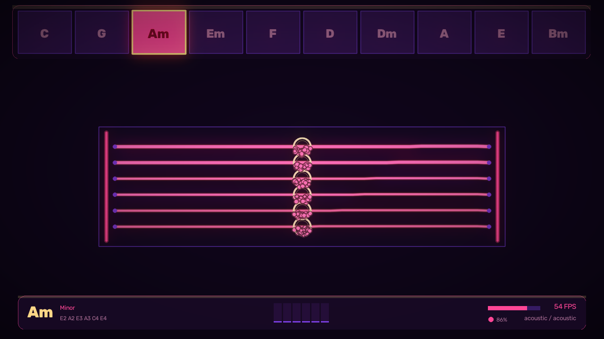

# Virtual Air Guitar

Play a guitar in the air in front of your webcam. Point at a chord to select
it, strum six holographic strings with your other hand, and the sound is
synthesised in real time — no sample library required.



## Status

Working and measured on the development machine (Arch Linux, Python 3.13,
1280×720, in a dimly lit room):

| Metric | Measured |
|---|---|
| Render loop | **51–72 FPS** depending on how much is on screen |
| Frame budget | 14–19 ms |
| Capture + hand tracking thread | 20.0 FPS, 15 ms processing per frame |
| Module self-checks | 13/13 passing |

Numbers come from `--frames` runs on this machine with a real camera attached.
Your hardware will differ; the status strip shows live figures.

**The camera, not the renderer, sets the ceiling.** The capture thread is the
slow half here, and it is limited by the webcam rather than by any code: this
sensor tops out at 30 FPS, and a dim room costs some of that even with the
exposure workaround below. Rendering has roughly 2.5× the headroom it needs.

## Requirements

- Python 3.12+
- A webcam
- Linux, macOS or Windows

MediaPipe 1.x is required. The old `mediapipe.solutions.hands` API this
project originally targeted no longer exists; tracking uses the current
Tasks API (`HandLandmarker`).

## Install and run

```bash
python -m venv venv
source venv/bin/activate          # Windows: venv\Scripts\activate
pip install -r requirements.txt
python src/main.py
```

The hand-tracking model (~7.8 MB) downloads automatically on first run into
`assets/models/`.

### Command line

```bash
python src/main.py                      # normal run
python src/main.py --selftest           # run all module self-checks, exit
python src/main.py --theme synthwave    # start on a given theme
python src/main.py --fullscreen
python src/main.py --headless --frames 300 --shots out/   # render to PNGs
```

`--headless` is useful over SSH or in CI: it runs the whole pipeline and
writes frames to disk instead of opening a window.

## Playing it

**Everything is reachable by pointing.** Chords are the top row, instruments
the row beneath. Nothing needs the keyboard — which matters, because OpenCV
windows do not reliably receive key events under Wayland.

**Chords — point at the bar.** Raise a hand so your index finger reaches the
row of chord buttons across the top, and rest it on one. A progress bar fills
along the button; when it completes, the chord is armed. No click gesture is
needed. If waiting feels slow, **pinch** thumb to index to commit instantly.

Buttons are roughly 120 × 90 px, which jittery tracking hits reliably. Only
the horizontal position matters once your hand is at that height, so you are
aiming along one axis rather than two.

**Strumming — sweep across the strings.** Sweep your other hand vertically
across the strings. Each string you cross is plucked. Sweep faster for a
louder, brighter strike; downward and upward strokes are both detected. Only
sweeps above a speed threshold count, so resting your hand in frame is safe.

**Either hand can do either job.** Roles follow where your hands are, not
which hand is which: whichever hand is up at the chord bar points, and one
below it strums. Left- and right-handed players need no setting, and a
mislabelled hand cannot swap your controls mid-song. With only one hand in
frame, that hand does both — it strums low and selects when you raise it.

Hold a pose for a few frames for it to register — the recogniser deliberately
requires consecutive agreeing frames so tracking noise cannot trigger a mode
change mid-song.

### Keyboard

| Key | Action |
|---|---|
| `ESC` / `Q` | quit |
| `1`–`5` | dark / cyber blue / neon purple / synthwave / minimal |
| `Z X C V B N` | tone: acoustic, electric, clean, distortion, muted, fingerstyle |
| `G` | guitar: acoustic / electric / bass / ukulele |
| `[` `]` | previous / next chord |
| `K` | cycle chord quality (7, Maj7, Sus2, Sus4, Power) |
| `-` `=` | volume |
| `M` | mute |
| `P` | pause |
| `R` | reset |
| `H` | help overlay |
| `D` | draw hand skeletons |

The bar carries the ten chords most songs are built from. `K` layers the
extra qualities on top of whichever chord is armed.

### Gestures

| Gesture | Action |
|---|---|
| Point and rest | select the chord under your finger |
| Pinch | select it immediately, without the wait |
| Sweep across strings | strum |
| Swipe ←/→ | previous / next chord |
| Thumbs up | electric tone |
| Peace sign | acoustic tone |
| Rock horns | distortion tone |
| OK sign | fingerstyle tone |
| Closed fist | mute |
| Open hand | unmute |

Poses are only read from the hand raised at the chord bar. A hand resting
between strums curls into something that reads as a closed fist, and taking
poses from the picking hand meant it muted itself mid-song. Swipes are the
exception — a sweep is deliberate enough to accept from either hand.

## Instruments

Point at the instrument row under the chords to switch, the same way you pick
a chord. `G` cycles them from the keyboard too. Bass and ukulele change the string count and the
octave, not just the timbre, so they play as genuinely different instruments
rather than the same guitar through another amp:

| Instrument | Strings | Tuning | Default tone |
|---|---|---|---|
| Acoustic | 6 | E2 A2 D3 G3 B3 E4 | acoustic |
| Electric | 6 | E2 A2 D3 G3 B3 E4 | electric |
| Bass | 4 | E1 A1 D2 G2 | clean |
| Ukulele | 4 | G3 C4 E4 A4 | fingerstyle |

Voicings are generated per tuning, so every chord button works on every
instrument with no per-instrument chord tables. Switching rebuilds the strings
and re-voices whatever chord is armed. Set `default_guitar` in `config.ini` to
choose the one you start on.

## Sound

There are no `.wav` files in this repository and none are needed. Every note
is synthesised at startup with **Karplus-Strong** plucked-string modelling: a
noise burst is fed into a delay line whose length sets the pitch, and a
lowpass loss filter in the feedback path produces the natural decay of a real
string.

Synthesis is vectorised block-wise — one numpy operation per pass over the
wavetable rather than a per-sample Python loop — so the whole 37-note range
renders in well under a second.

Six timbres vary decay, excitation brightness, pick-attack level, body
resonance and `tanh` saturation. `demo_guitar.wav` in the repo root is a
rendered C–G–Am–F progression followed by two distorted power chords, so you
can hear the engine without a webcam.

Chord voicings are generated, not tabulated: for each open string the lowest
fret within a five-semitone window landing on a chord tone is chosen. That
covers all 140 root × quality combinations without a lookup table, and power
chords correctly drop to the lowest three strings.

To use real samples instead, drop files into `assets/audio/<pack>/` named
`string_0.wav` … `string_5.wav`; they take precedence over synthesis.

## How it works

```
camera thread                     main loop
─────────────                     ─────────
VideoCapture                      snapshot() ── frame + both hands
  → mirror                            │
  → downscale to 480 px               ├── GestureRecognizer  poses, swipes
  → HandLandmarker (Tasks API)        ├── assign_roles  point vs. pick
  → EMA smoothing                     ├── ChordBar.update  hover, dwell, commit
  → derive pinch / extension          ├── StringSet.detect_strum  crossings
        │                             ├── AudioEngine.play_note
        └──── shared, lock-guarded    └── Renderer.render
```

Capture and inference run on a background thread so a slow camera never stalls
rendering; the loop always draws the most recent frame available.

| Module | Responsibility |
|---|---|
| `camera.py` | capture thread, HandLandmarker, smoothing, derived features |
| `gestures.py` | pose classification and swipes, with hysteresis |
| `strings.py` | string vibration and pick-crossing detection |
| `audio.py` | Karplus-Strong synthesis, voicing generation, playback |
| `ui.py` | chord bar and the holographic pointer |
| `renderer.py` | frame compositor |
| `effects.py` | bloom, colour grade, glassmorphism primitives |
| `particles.py` | pooled particle system and motion trails |
| `hud.py` | the bottom status strip |
| `animations.py` | easing curves, frame-rate independent smoothing |
| `themes.py` | five BGR-native palettes |
| `config.py` | typed settings backed by `config.ini` |

### Design decisions worth knowing

**Colours are stored BGR-native.** Every consumer is an OpenCV call, so
storing palettes in the renderer's own channel order removes a whole class of
red/blue swap bugs. `bgr(r, g, b)` converts once, at definition.

**Strings are damped standing waves, not a mass-spring chain.** A chain of
point masses is the obvious choice and the wrong one here: it needs
sub-stepping to stay stable, and at a visible number of segments it looks
coarse. A decaying sine in the fundamental plus a quieter second harmonic is
cheaper, unconditionally stable, and closer to how a real string reads.

**Fingers are "extended" by joint distance, not coordinates.** Comparing the
tip's distance from the wrist against the middle joint's is rotation
invariant, so poses survive a tilted hand.

**The particle pool never allocates.** State lives in preallocated numpy
arrays; retiring a particle swaps it with the live tail to keep the active
slice contiguous.

**Hand smoothing is speed-adaptive, not a fixed factor.** A single smoothing
constant cannot win: low enough to settle a resting hand and it lags badly
behind a fast one; high enough to follow a strum and a still hand shivers. A
1e (One Euro) filter varies its cutoff with measured hand speed instead.
Measured at 20 FPS capture, positional lag against the old fixed α = 0.45:

| Hand speed | Fixed α | Adaptive |
|---|---|---|
| Slow | 61 ms | 43 ms |
| Medium | 61 ms | 24 ms |
| Fast | 61 ms | **14 ms** |

Jitter on a resting hand rose 3% for that, which is the trade worth making.
`responsiveness` in `config.ini` is the knob.

**Strum detection runs on camera samples, not render frames.** The render loop
is ~2.5× faster than the camera, so it kept re-measuring the *same* hand
position against its own much shorter frame time. A 50 ms motion was timed as
18 ms, and every strum, however gentle, came out at maximum velocity:

| Strum speed | Before | After |
|---|---|---|
| 600 px/s | 1.00 | 0.40 |
| 1200 px/s | 1.00 | 0.80 |
| 2500 px/s | 1.00 | 1.00 |

**One target axis beats two.** The chord bar replaced a pair of radial dials.
A dial asks you to land a fingertip inside a 26° arc of a 44 px ring — an
angle *and* a radius, both wrong if your hand drifts. A button in a row needs
one coordinate to be right, over a target several times larger.

### Performance notes

Two rounds of work here, and the second mattered far more than the first.

**Round one — rendering.** The first working version ran at 18.9 FPS.
Profiling each stage found four hot spots:

| Stage | Before | After | Fix |
|---|---|---|---|
| Vignette + scanlines | 18.5 ms | 0.67 ms | baked into one cached uint8 mask, one `cv2.multiply` |
| HUD | 10.2 ms | 2.2 ms | box blur instead of a 55-tap Gaussian; meters blend inside their own rect |
| Backdrop | 5.3 ms | 1.7 ms | constant tint added as a scalar instead of a full-frame array |
| Bloom | 5.3 ms | 2.2 ms | fused `addWeighted` instead of per-pixel screen blending |

**Round two — the camera, which was the real problem all along.** Rendering
was already fast and the app still felt laggy, because the input was slow and
nothing was measuring it honestly:

| Cause | Effect | Fix |
|---|---|---|
| No FOURCC set, so OpenCV picked uncompressed YUYV | this webcam offers 720p YUYV **at 8 FPS only** — a hardware limit | request `MJPG` before the frame size |
| `exposure_dynamic_framerate` on by default | in a dim room the sensor stretches its exposure past the frame interval, delivering **7.5 FPS while reporting 30** | turn it off, keeping auto-exposure adaptive; manual-exposure fallback elsewhere |
| Detection ran on the full 1280×720 frame | ~14 ms per frame for pixels the model cannot use | detect at 480 px wide; landmarks are normalised, so coordinates are unchanged |
| `snapshot()` copied every frame | 2.7 MB memcpy per frame | hand out the reference; the capture thread never rewrites a published frame |
| `capture_fps` timed only processing, not the blocking read | reported **55.9 FPS while the camera delivered 7.5** | time the whole iteration |

Capture went from 7.5 to a measured 20.0 FPS. That last row is the one worth
remembering: the metric was hiding the bottleneck, so every earlier round of
optimisation was aimed at the half of the system that was already fast.

The lesson repeated at every step: never composite over the whole frame to
change a small rectangle.

If you need more headroom, lower `particle_count`, `render_width`/`height`, or
set `glow_intensity = 0` in `config.ini` to skip bloom entirely.

## Configuration

`config.ini` is created on first run.

```ini
[camera]
device_index = 0
resolution_width = 1280
resolution_height = 720
target_fps = 30           ; ask for what the camera can actually deliver
flip_horizontal = True
smoothing = 0.45          ; how hard a *still* hand is smoothed
responsiveness = 3.0      ; how fast the filter opens up for a moving hand
limit_exposure = True     ; stop auto-exposure lowering the frame rate

[audio]
sample_rate = 44100
latency_ms = 12.0         ; mixer buffer; raise if audio crackles
master_volume = 0.75
default_pack = acoustic
default_guitar = acoustic ; acoustic | electric | bass | ukulele

[ui]
render_width = 1280
render_height = 720
fullscreen = False
glow_intensity = 1.0      ; 0 disables bloom
particle_count = 450
string_spacing = 34.0     ; at 720p; scales with frame height
default_theme = cyber_blue
gesture_sensitivity = 0.7
camera_opacity = 0.55     ; how visible the camera feed is behind the UI

[debug]
show_fps = True
show_landmarks = False
log_level = INFO
```

## Tests

Every module carries a `_self_check()` exercising its real behaviour —
vibration actually decays, the particle pool actually drains and is reusable,
a slow hand drift is not mistaken for a swipe, an upstroke reports the
opposite direction to a downstroke, corrupt config values fall back to
defaults rather than crashing.

```bash
python src/main.py --selftest     # all modules
python src/strings.py             # or one module directly
```

No test framework required.

## Troubleshooting

**No window appears.** Check `python -c "import cv2; print(cv2.getBuildInformation())" | grep GUI`.
A `headless` OpenCV build cannot open windows — install `opencv-python`, not
`opencv-python-headless`. Use `--headless --shots out/` to verify rendering
regardless.

**Hands are not detected.** The status strip's confidence dot and percentage
show live tracking. Get more light on your hands, keep them roughly 0.5–1.5 m
from the camera, and make sure they contrast with the background.

**Everything feels sluggish / the picture is dark.** Check the FPS reading on
the status strip. If it is fine but tracking lags behind your hands, the
camera is the bottleneck — the app logs the format and rate it negotiated at
startup. `limit_exposure = True` stops the sensor trading frame rate for
light, which is usually the cause; the cost is a darker picture in a dim room.
Turning on a light fixes both that and the tracking, which needs the light
more than the backdrop does. Set `limit_exposure = False` to hand exposure
back to the camera.

**Strums trigger when you did not mean them.** Raise `min_speed` in
`StringSet.detect_strum`, or move your resting hand outside the fretboard
rectangle.

**Strums are missed.** You may be sweeping faster than the camera samples.
Lower `resolution_width`/`height` for a higher capture rate.

**Audio crackles.** Raise `latency_ms` to 20–30.

**Camera busy.** Another application holds it; close it or set a different
`device_index`.

## Limitations

- Hand tracking is 2D. Depth is not used, so there is no distance-based
  dynamics — velocity comes from on-screen speed.
- Rendering is CPU-only. There is no GPU path.
- One camera, two hands.
- Audio out only; no MIDI export yet.
- Bright backlighting behind your hands degrades tracking noticeably.

## Roadmap

- MIDI output so the chord bar can drive a DAW
- Loop recording and overdub
- Per-string damping for palm muting
- Alternate tunings (drop D, open G)
- Optional GPU compositing

## License

MIT — see `LICENSE`.
